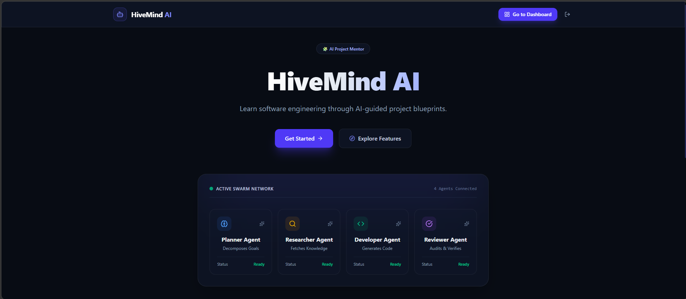
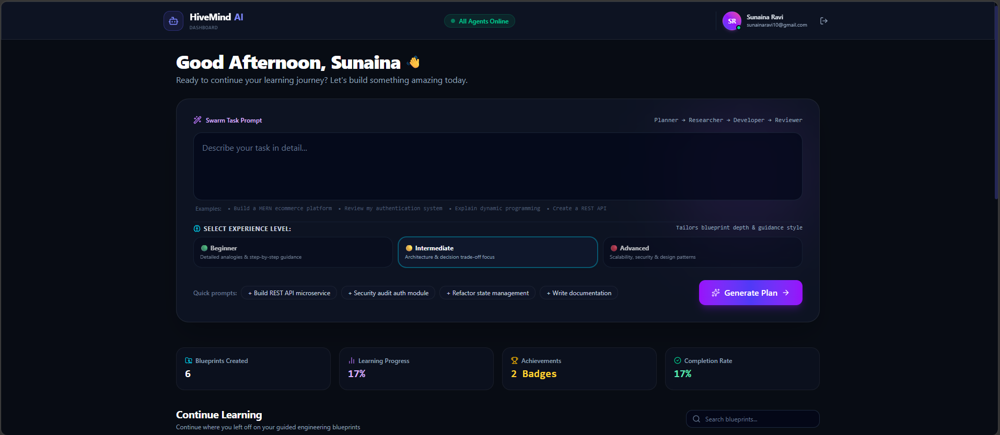
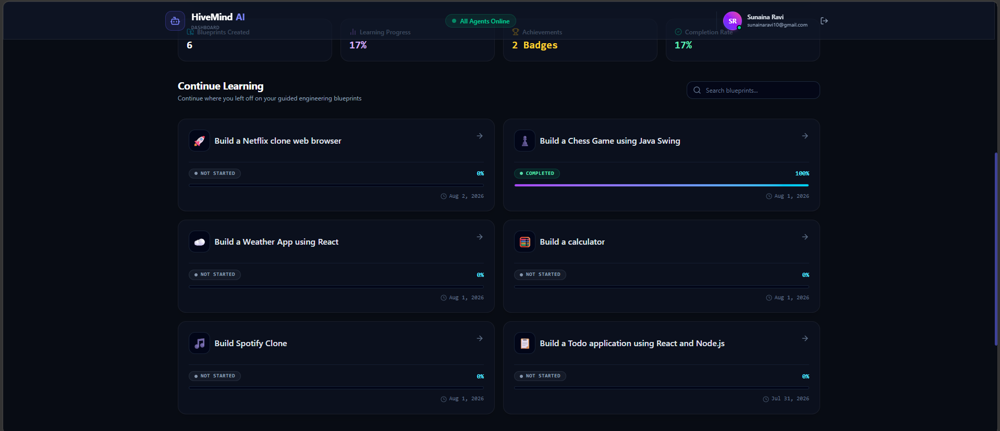
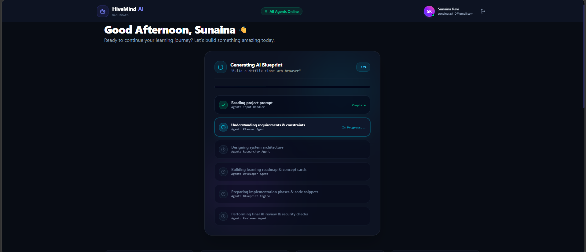
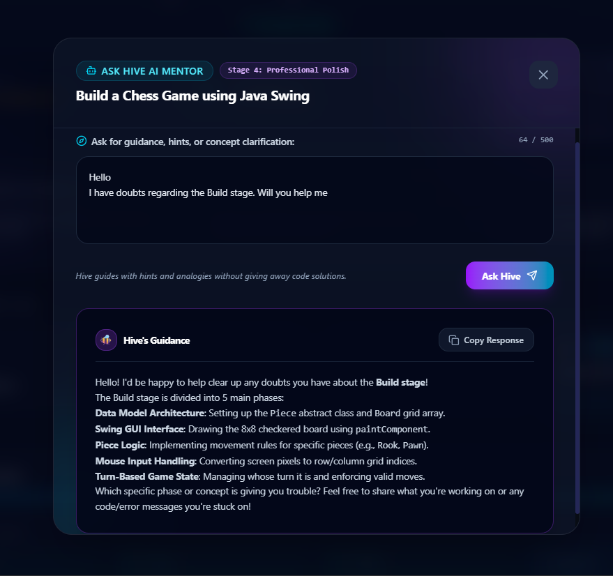
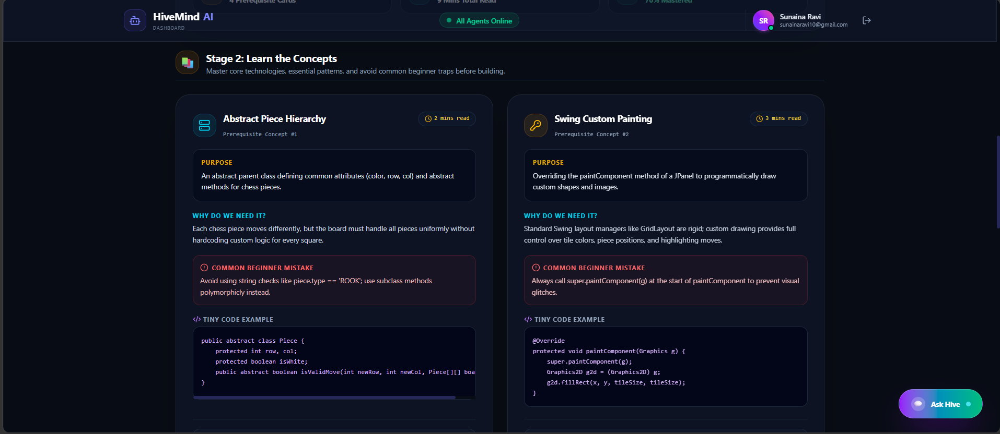

# 🚀 HiveMind AI


<p align="center">
  
</p>

<h3 align="center">
Learn Software Engineering Through AI-Guided Project Blueprints
</h3>

<p align="center">
HiveMind AI transforms project ideas into structured, interactive learning blueprints. Rather than generating code alone, it helps learners understand concepts, design architecture, implement features, and improve projects through AI-assisted mentorship.
</p>

<p align="center">
🌐 <a href="https://hivemind-ai-five.vercel.app"><strong>Live Demo</strong></a>
&nbsp; • &nbsp;
💻 <a href="https://github.com/Suunaina/hivemind-ai"><strong>GitHub Repository</strong></a>
</p>

---

# ✨ Features

### 🤖 AI-Powered Learning

- Generate structured project blueprints using Gemini AI.
- Four-stage guided learning workflow:
  **Understand → Learn → Build → Improve**
- AI Mentor providing contextual hints and explanations.
- Personalized learning paths for Beginner, Intermediate, and Advanced learners.

### 📚 Interactive Learning Experience

- AI-generated architecture diagrams.
- Concept explanations with beginner-friendly examples.
- Step-by-step implementation roadmap.
- Professional recommendations covering performance, testing, deployment, and best practices.

### 📈 Progress Tracking

- Persistent progress across sessions.
- Interactive learning dashboard.
- Achievement and badge system.
- Resume learning exactly where you left off.

### 🔐 Authentication & Security

- JWT-based authentication.
- Secure backend API.
- Protected application routes.

### 🎨 User Experience

- Responsive design for desktop and mobile.
- Modern glassmorphism interface.
- Smooth Framer Motion animations.
- Interactive and intuitive learning workflow.

---

# 🛠 Tech Stack

## Frontend

- React 19
- Vite
- Tailwind CSS
- Framer Motion
- React Router
- Axios

## Backend

- Node.js
- Express.js
- MongoDB Atlas
- JWT Authentication
- Gemini API

## Deployment

- Vercel (Frontend)
- Render (Backend)
- MongoDB Atlas (Database)

---

# 📸 Screenshots

## 🏠 Landing Page


---

## 📊 Dashboard



---

## 📚 Continue Learning



---

## 🤖 AI Blueprint Generation



---

## 💬 Ask Hive Mentor



---

## 🧠 Learning Blueprint



---

# 🏗 System Architecture

HiveMind AI follows a modern full-stack architecture where the frontend communicates with a secure backend API, which handles authentication, AI interactions, and database operations.

```text
                +---------------------------+
                |      React + Vite UI      |
                |        (Vercel)           |
                +-------------+-------------+
                              |
                              | HTTPS REST API
                              |
                +-------------v-------------+
                |   Express.js Backend      |
                |        (Render)           |
                +------+------+-------------+
                       |      |
          Gemini API   |      | MongoDB Atlas
                       |      |
               +-------v--+   +--------------+
               | Gemini AI|   |  MongoDB     |
               +----------+   +--------------+
```

---

# 🚀 Local Setup

### Clone the Repository

```bash
git clone https://github.com/Suunaina/hivemind-ai.git
cd hivemind-ai
```

### Frontend

```bash
cd client
npm install
npm run dev
```

### Backend

```bash
cd server
npm install
npm run dev
```

---

# 🔑 Environment Variables

### Backend (`server/.env`)

```env
PORT=
MONGO_URI=
JWT_SECRET=
GEMINI_API_KEY=
GEMINI_MODEL=
CLIENT_URL=
```

### Frontend (`client/.env`)

```env
VITE_API_URL=
```

---

# 📂 Project Structure

```text
hivemind-ai/
│
├── client/
│   ├── src/
│   ├── public/
│   └── package.json
│
├── server/
│   ├── src/
│   │   ├── controllers/
│   │   ├── middleware/
│   │   ├── models/
│   │   ├── routes/
│   │   ├── services/
│   │   └── index.js
│   └── package.json
│
├── screenshots/
├── README.md
└── package.json
```

---

# ⭐ Key Highlights

- 🤖 AI-powered project blueprint generation
- 🧠 Context-aware AI mentor
- 🏗 Interactive architecture visualization
- 📚 Personalized learning paths
- 📈 Persistent progress tracking
- 🏆 Achievement and badge system
- 🔐 JWT authentication
- 🎨 Responsive glassmorphism UI
- ☁️ Cloud deployment using Vercel and Render

---

# 🎯 Future Enhancements

- Export blueprints as PDF
- Team collaboration
- Public project sharing
- Enhanced AI mentor personalization
- Support for additional LLM providers

---

# 👩‍💻 Author

**Sunaina**

- GitHub: https://github.com/Suunaina
- LinkedIn: *(Add your LinkedIn profile URL)*

---

# 📄 License

This project is licensed under the MIT License.
